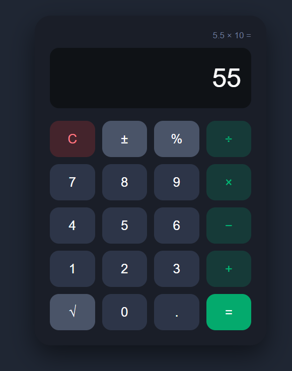

<div align="center">
<h1>🧮 Simple Calculator</h1>

 
A clean, beginner-friendly calculator built with **HTML**, **CSS** and **JavaScript**.
 


 
</div>
---
 
## 📸 Preview
 
<div align="center">
<!-- Add your screenshot in the repo and change the file name below -->

</div>
---
 
## ✨ Features
 
| Feature | Description |
|---|---|
| ➕ ➖ ✖️ ➗ | Basic operations: add, subtract, multiply, divide |
| `%` | Percentage |
| `√` | Square root |
| `±` | Switch between positive and negative |
| `C` | Clear everything |
| 🕘 | Shows the last step above the screen |
| 🌙 | Dark theme with a clean layout |
| ⚠️ | Error message when dividing by 0 |
 
---
 
## 🚀 How to Run
 
1. Download or clone this repository
```bash
   git clone https://github.com/aasthaverma00/calculator.git
```
2. Keep `index.html`, `style.css` and `script.js` in the same folder
3. Open `index.html` in your browser
That's it, no installation needed. 🎉
 
---
 
## 📁 Project Structure
 
```
simple-calculator/
├── index.html   → Calculator layout
├── style.css    → Design and colors
└── script.js    → Calculator logic
```
 
---
 
## 🛠️ Built With
 
- **HTML**: structure of the calculator
- **CSS**: styling and button grid
- **JavaScript**: all the calculation logic
---
 
<div align="center">
Made with ❤️ as a beginner project
 
⭐ Star this repo if you liked it!
 
</div>
 
